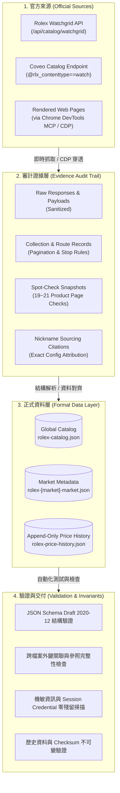
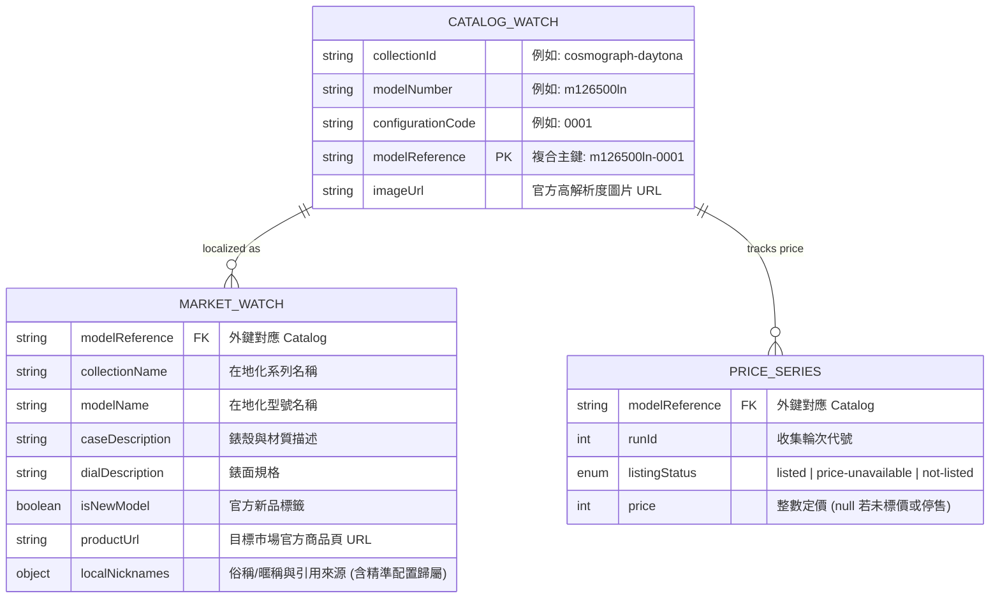

# Rolex Watch Index 腕錶索引與多市場價格資料庫

[](data/schemas/)
[](#市場涵蓋矩陣與稅制語意)
[](data/catelog/rolex-catalog.json)
[](#資料完整性與不可變性檢查-invariants)

**Rolex Watch Index** 是一個針對 Rolex（勞力士）全球官方在售腕錶配置、多國在地化規格與時間序列價格歷史的結構化資料集與工程管道。

本專案採行嚴格的 **Schema 契約規範（JSON Schema Draft 2020-12）**、**證據保留層（Evidence Audit Trail）** 與 **參照完整性（Referential Integrity）**，確保所有資料點皆具備 100% 可重現性（Reproducibility）、可驗證性（Verifiability）與明確的在地稅務語意。

---

## 系統架構與資料流 (Data Pipeline Architecture)

本專案將資料生命週期嚴格切分為「資料獲取」、「審計存證」、「正式契約儲存」與「不變量驗證」四個階段：



---

## 核心資料實體與 Schema 模型 (Entity Models)

資料以三份解耦的核心 JSON 檔案組成，透過全局唯一主鍵 `modelReference` 相互關聯：



### 1. 全局配置目錄 (`data/catelog/rolex-catalog.json`)
* **用途**：市場無關（Market-agnostic）的全局腕錶配置聯集。
* **複合鍵規則**：`modelReference = ${modelNumber}-${configurationCode}`（例如 `m126500ln-0001`）。
* **結構定義**：[rolex-catalog.schema.json](data/schemas/rolex-catalog.schema.json)。

### 2. 市場在地化元資料 (`data/markets/rolex-[market]-market.json`)
* **用途**：特定市場的在地化文字、官方商品頁連結、系列俗稱（Collection Aliases）與型號暱稱（Local Nicknames）。
* **暱稱認定準則**：必須具備精準至 4 位 configurationCode 的可信來源引用（如「熊貓」僅賦予白面 Daytona `m126500ln-0001`，黑面 `m126500ln-0002` 則不適用）。
* **結構定義**：[rolex-market.schema.json](data/schemas/rolex-market.schema.json)。

### 3. 時間序列價格歷史 (`data/history/[marketCode]/rolex-price-history.json`)
* **用途**：單一市場的 Append-only 歷史定價紀錄。
* **價格語意規範**：
  * `tax-include`：含稅價，記錄法定稅率 `taxRatePercent`（如 DE 19%, AT 20%, GB 20%, SG 9% GST, JP 10%, TW 5%）。
  * `tax-exclude`：未稅價，`taxRatePercent` 為 `null`（如 US 因各州消費稅不同而不預設固定稅率）。
  * `no-tax`：免消費稅市場，`taxRatePercent` 嚴格記錄為 `0`（如 HK 無增值稅/消費稅）。
* **結構定義**：[rolex-price-history.schema.json](data/schemas/rolex-price-history.schema.json)。

---

## 專案目錄結構 (Directory Structure)

```text
rolex-watch-index/
├── data/
│   ├── schemas/                          # JSON Schema (Draft 2020-12) 契約定義
│   │   ├── rolex-catalog.schema.json
│   │   ├── rolex-market.schema.json
│   │   └── rolex-price-history.schema.json
│   ├── catelog/                          # 全局配置目錄 (保留原有拼寫目錄)
│   │   └── rolex-catalog.json
│   ├── markets/                          # 各市場在地化元資料
│   │   ├── rolex-austria-market.json     # AT (de-AT)
│   │   ├── rolex-germany-market.json     # DE (de-DE)
│   │   ├── rolex-hong-kong-market.json   # HK (zh-Hant-HK)
│   │   ├── rolex-japan-market.json       # JP (ja-JP)
│   │   ├── rolex-singapore-market.json   # SG (en-SG)
│   │   ├── rolex-switzerland-market.json # CH (de-CH)
│   │   ├── rolex-taiwan-market.json      # TW (zh-Hant-TW)
│   │   ├── rolex-united-kingdom-market.json # GB (en-GB)
│   │   └── rolex-united-states-market.json  # US (en-US)
│   ├── history/                          # 依市場劃分的 Append-only 價格歷史
│   │   ├── [AT|CH|DE|GB|HK|JP|SG|TW|US]/
│   │   │   └── rolex-price-history.json
│   └── evidence/                         # 收集過程審計日誌與驗證快照 (按日期歸檔)
│       └── [marketCode]/[YYYY-MM-DD]/
│           ├── collection-route.json     # 抓取路徑、API 參數與終止條件
│           ├── validation-summary.json   # 各項 Invariant 與交叉驗證結果
│           ├── nickname-research.json    # 暱稱考證與來源出處 (含排除原因)
│           └── spot-checks.json          # 官方商品頁獨立抽檢比對紀錄
├── rolex-data-collection-guide.md        # 多市場資料收集與驗證作業標準規範 (SOP)
└── README.md                             # 專案技術文件
```

---

## 市場涵蓋矩陣與稅制語意 (Market Coverage Matrix)

| 市場代碼 | 國家 / 地區 | 語系 (Locale) | 幣別 | 價格類型 (`priceType`) | 法定稅率 (`taxRatePercent`) | 配置筆數 | 價格區間 (Min ~ Max) | 核心採集通道 |
| :--- | :--- | :--- | :--- | :--- | :--- | :--- | :--- | :--- |
| **AT** | 奧地利 | `de-AT` | EUR | `tax-include` | `20%` (Normalsteuersatz) | 1,465 | €6,000 ~ €181,000 | `/api/catalog/watchgrid` + CDP |
| **DE** | 德國 | `de-DE` | EUR | `tax-include` | `19%` (MwSt.) | 1,465 | €5,950 ~ €179,500 | `/api/catalog/watchgrid` |
| **GB** | 英國 | `en-GB` | GBP | `tax-include` | `20%` (VAT) | 1,465 | £5,150 ~ £155,400 | `/api/catalog/watchgrid` + CDP |
| **HK** | 香港 | `zh-Hant-HK` | HKD | `no-tax` | `0%` (無消費稅/增值稅) | 1,465 | HK$49,900 ~ HK$1,506,400 | `/api/catalog/watchgrid` + CDP |
| **JP** | 日本 | `ja-JP` | JPY | `tax-include` | `10%` (消費税) | 1,465 | ¥898,700 ~ ¥26,829,000 | `/api/catalog/watchgrid` |
| **SG** | 新加坡 | `en-SG` | SGD | `tax-include` | `9%` (GST) | 1,465 | S$8,650 ~ S$262,500 | `/api/catalog/watchgrid` + CDP |
| **CH** | 瑞士 | `de-CH` | CHF | `tax-include` | `8.1%` (MWST) | 1,465 | CHF 5'500 ~ CHF 165'900 | 官方 `de-ch` 模型視圖 + Chrome DevTools DOM |
| **TW** | 台灣 | `zh-Hant-TW` | TWD | `tax-include` | `5%` (營業稅) | 1,465 | NT$208,000 ~ NT$6,279,000 | `/api/catalog/watchgrid` |
| **US** | 美國 | `en-US` | USD | `tax-exclude` | `null` (依各州/地區而異) | 1,465 | $6,200 ~ $186,200 | Coveo API + Rolex Detail Batch |

> [!NOTE]
> **稅率語意審計說明**：
> 部分市場（如香港）官方頁面雖使用通用制式文案（如「已含增值税之參照零售價」），但本專案不盲從前端 UI 樣板字串，而是依據各國稅務主管機關（如香港稅務局 IRD、新加坡 IRAS、奧地利 USP.gv.at）進行法定稽核，如實記錄為 `no-tax` (`0%`) 或 `tax-include` (`9% GST`)。

## 資料工程與採集機制 (Data Engineering & Scraping Notes)

### 1. 結構化端點探測 (Structured Endpoint Discovery)
Rolex 官方網頁採用動態前端渲染，資料主要來源為：
* **Watchgrid REST API**：`GET /api/catalog/watchgrid?language={lang}&countryCode={market}&group=(0)&firstResult=0&numberOfResults=2000`
* **Coveo 搜尋端點**：查詢語法 `@rlx_contenttype==watch AND @rlx_lang=={lang}`，搭配 Batch Detail 交叉校對。

### 2. Akamai Bot Manager (WAF) 穿透策略
直接透過 `curl` 或無頭腳本請求常會觸發 Akamai 403 Forbidden。工程流程採用 **Chrome DevTools Protocol (CDP)** / Chrome DevTools MCP，在具備真實瀏覽器上下文（TLS 指紋、瀏覽器環境變數與 Session 生命週期）下執行同源 `fetch()`，安全且穩定地獲取官方全量資料。

### 3. 暱稱消歧義考證體系 (Nickname Disambiguation)
社群暱稱（如 Panda、Batman、Batgirl、Starbucks、綠水鬼）具有高歧義性。本專案嚴格要求：
1. **精準至配置代碼**：例如 `Batgirl` 專指 Jubilee 五珠帶款 `m126710blnr-0002`，而 `Batman` 專指 Oyster 三板帶款 `m126710blnr-0003`，兩者不可混淆。
2. **在地出版物引證**：必須附帶目標市場具實體門市或權威鐘錶媒體之 URL 佐證。
3. **停產與跨代排除**：歷史型號（如已停產之舊款綠水鬼 16610LV Kermit 或 116610LV Hulk）不得強加於當前目錄代碼上。

---

## 開發者使用範例 (Developer Usage & Integration)

### 1. TypeScript / Node.js 資料整合

透過 `modelReference` 將全局目錄、在地化名稱與歷史價格進行聯表查詢（Join）：

```typescript
import * as fs from 'fs';
import * as path from 'path';

interface CatalogWatch {
  collectionId: string;
  modelNumber: string;
  configurationCode: string;
  modelReference: string;
  imageUrl: string;
}

interface MarketWatch {
  modelReference: string;
  collectionName: string;
  modelName: string;
  localNicknames: { names: string[]; sources: any[] };
  productUrl: string;
}

interface PriceHistory {
  currencyCode: string;
  priceType: string;
  taxRatePercent: number | null;
  priceSeries: Record<string, Array<{ runId: number; listingStatus: string; price: number | null }>>;
}

// 載入資料
const catalog = JSON.parse(fs.readFileSync('data/catelog/rolex-catalog.json', 'utf8'));
const twMarket = JSON.parse(fs.readFileSync('data/markets/rolex-taiwan-market.json', 'utf8'));
const twHistory: PriceHistory = JSON.parse(fs.readFileSync('data/history/TW/rolex-price-history.json', 'utf8'));

// 建立 Market Map
const marketMap = new Map<string, MarketWatch>(
  twMarket.watches.map((w: MarketWatch) => [w.modelReference, w])
);

// 查詢包含「熊貓」或「綠水鬼」的腕錶當前價格
const targetNicknames = ['熊貓', '綠水鬼', '黑水鬼'];

catalog.watches.forEach((watch: CatalogWatch) => {
  const meta = marketMap.get(watch.modelReference);
  if (!meta) return;

  const hasTargetNickname = meta.localNicknames.names.some(n => targetNicknames.includes(n));
  if (hasTargetNickname) {
    const historyPoints = twHistory.priceSeries[watch.modelReference];
    const latestPrice = historyPoints ? historyPoints[historyPoints.length - 1] : null;

    console.log({
      ref: watch.modelReference,
      name: `${meta.collectionName} ${meta.modelName}`,
      nicknames: meta.localNicknames.names,
      price: latestPrice?.price ? `NT$ ${latestPrice.price.toLocaleString()}` : 'N/A',
      image: watch.imageUrl,
    });
  }
});
```

### 2. Python (Pandas) 多市場價格套利與比較分析

```python
import json
import pandas as pd

# 讀取全局目錄
with open('data/catelog/rolex-catalog.json', 'r', encoding='utf-8') as f:
    catalog = json.load(f)

# 讀取指定市場歷史價格
markets = ['TW', 'HK', 'JP', 'US', 'DE']
records = []

for m in markets:
    with open(f'data/history/{m}/rolex-price-history.json', 'r', encoding='utf-8') as f:
        hist = json.load(f)
        currency = hist['currencyCode']
        for ref, series in hist['priceSeries'].items():
            latest = series[-1]
            if latest['listingStatus'] == 'listed':
                records.append({
                    'modelReference': ref,
                    'market': m,
                    'currency': currency,
                    'price': latest['price']
                })

df = pd.DataFrame(records)
pivot_df = df.pivot(index='modelReference', columns='market', values='price')
print(pivot_df.head(10))
```

---

## 資料完整性與不可變性檢查 (Invariants)

本專案每次更新必須通過以下自動化與邏輯驗證：

1. **嚴格 JSON 格式校驗**：不允許尾隨逗號（Trailing commas）、重複鍵（Duplicate keys）或格式錯誤。
2. **Schema Draft 2020-12 一致性**：所有輸出嚴格符合 `data/schemas/` 定義。
3. **參照完整性（Referential Invariant）**：
   - 每個市場 `market.watches` 的 `modelReference` 必須在 `catalog.watches` 中 100% 存在且唯一。
   - 每個 `priceSeries` 的 Key 必須與該市場的 `marketWatch` 形成雙向一對一對應（Bijective Mapping）。
4. **時序單調遞增（Monotonic RunId）**：價格歷史中每個 Series 的 `runId` 必須按遞增排序，且對應到合法的 `collectionRuns` 紀錄。
5. **零機敏資訊外洩（Zero Credentials Leakage）**：Evidence 與正式資料層皆經過 Token / Cookie / Authorization Header 遮蔽與敏感資訊掃描。

---

## 維護與資料更新工作流程 (Contribution Workflow)

維護或新增市場資料時，請嚴格遵守 [rolex-data-collection-guide.md](rolex-data-collection-guide.md) 中的標準作業規範：

1. **探測官方結構化端點**：優先確認 `/api/catalog/watchgrid` 或等價官方資料來源。
2. **採集並沉澱證據**：將原始響應、分頁邊界證據與終止紀錄寫入 `data/evidence/[marketCode]/[YYYY-MM-DD]/`。
3. **核對與更新正式層**：更新 `data/markets/` 與 `data/history/`，並依據聯集規則更新 `data/catelog/rolex-catalog.json`。
4. **執行獨立抽檢**：隨機及代表性抽查至少 19~21 筆官方商品頁，驗證 URL、在地化名稱與幣別價格完全吻合。
5. **執行全庫驗證並出具報告**。

---

## 範疇與限制 (Scope & Limitations)

* **數據範疇**：本資料庫收錄之資料為官方於記錄時間點公開發布之目錄配置與建議零售價（MSRP / RRP），不包含二級市場行情、二手價格或授權經銷商（AD）之庫存水位。
* **歷史保存原則**：目錄資料庫採只增不減原則（Retentive）；若特定配置於未來下架，該配置將於價格歷史標記為 `not-listed`，但仍保留於 `rolex-catalog.json` 以確保歷史關聯不中斷。
